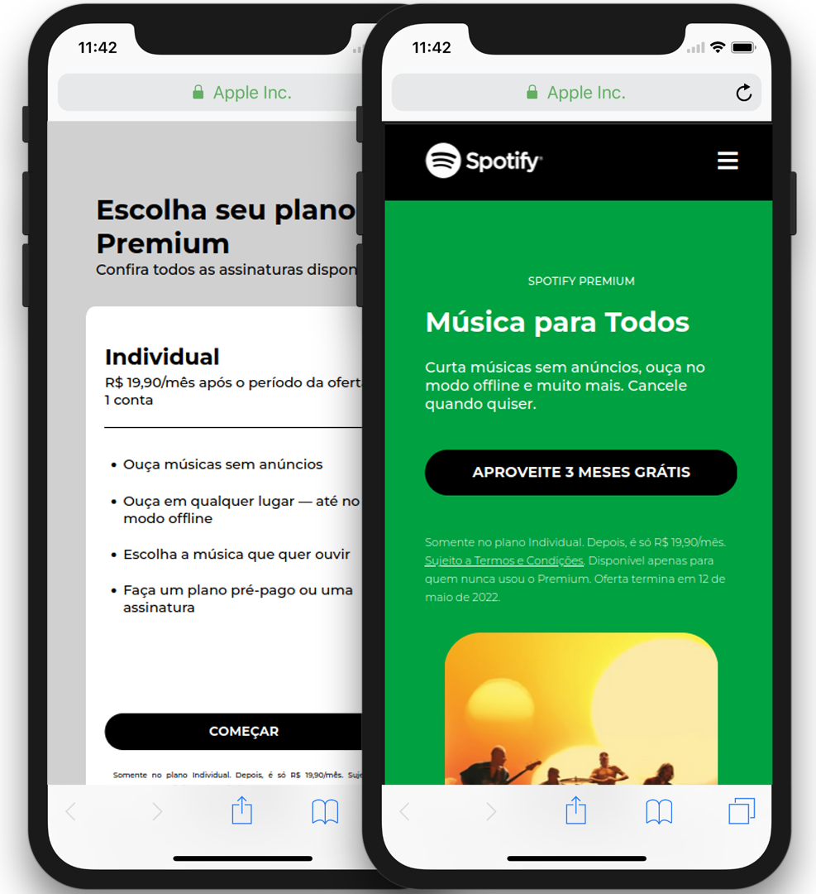
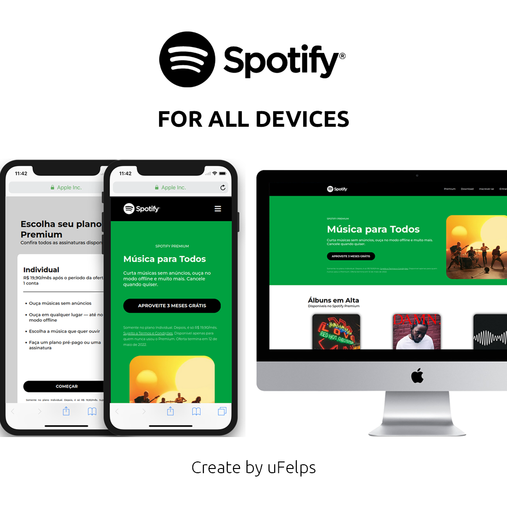

  

&nbsp;

# Spotify

Este repositório é um projeto para recriar a página principal do Spotify, utilizando um design moderno e totalmente responsivo.

&nbsp;

  

&nbsp;

## Tecnologias Utilizadas

 
  
  

&nbsp;

# Mobile

  

&nbsp;

# No Desktop

  

